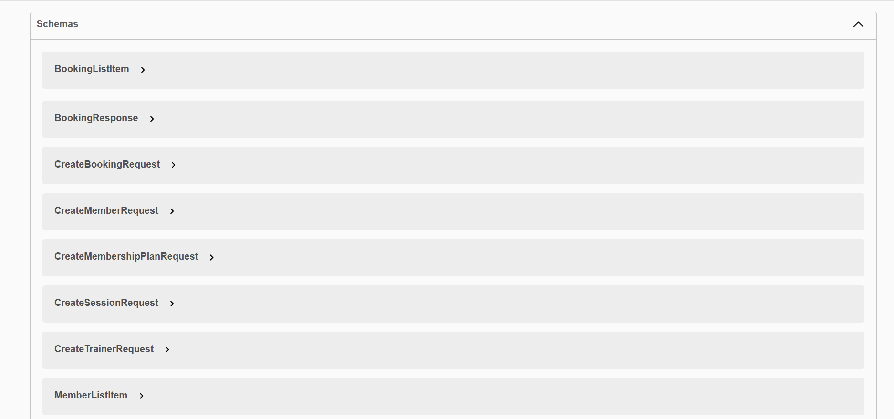
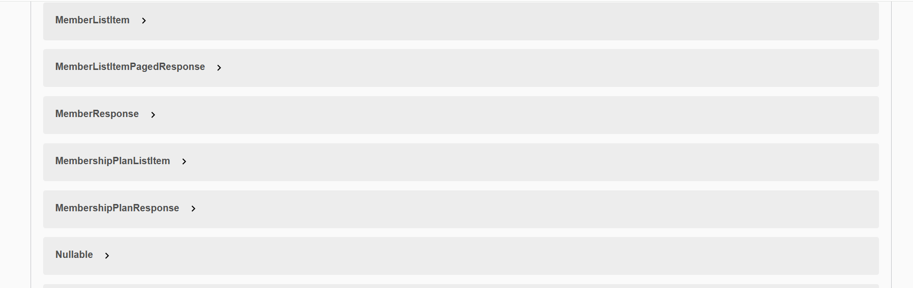
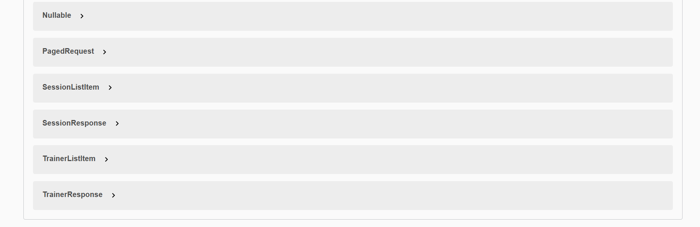

# gym-management-api
A RESTful API for managing gym operations built with ASP.NET Core and Onion Architecture.
# 🏋️ Gym Management System API

A RESTful API built with **ASP.NET Core (.NET 10)** for managing gym operations including members, trainers, sessions, bookings, and membership plans. The project follows **Onion Architecture** principles to ensure a clear dependency rule where all layers depend inward toward the Domain, keeping the core business logic completely isolated from infrastructure concerns.

---

## 📐 Architecture Overview

The solution is structured into four concentric layers, following the Onion Architecture pattern:

```
GymManagement/
├── Gym.Domain/          # Core (innermost) — Entities, Enums, Base classes
├── Gym.Application/     # Application ring — Services, DTOs, Interfaces
├── Gym.Infrastructure/  # Infrastructure ring — EF Core, Repositories, UnitOfWork
└── Gym.API/             # Outer layer — Controllers, Middleware, DI composition
```

### Dependency Flow

```
API  ──►  Infrastructure  ──►  Application  ──►  Domain
                                    ▲                ▲
                                    └────────────────┘
                              (Infrastructure implements
                               Application interfaces,
                               not the other way around)
```

- **Gym.Domain** — The core of the onion. Contains pure domain entities (`Member`, `Trainer`, `Session`, `Booking`, `MembershipPlan`) and enums (`MembershipStatus`, `SessionStatus`). Has **zero external dependencies**.
- **Gym.Application** — Defines repository and service interfaces (e.g., `IGenericRepository<T>`, `IUnitOfWork`) and implements business logic in services. Depends **only on Domain**.
- **Gym.Infrastructure** — Implements the interfaces defined in Application using EF Core + SQL Server. Contains Configurations, Migrations, GenericRepository, and UnitOfWork. Depends on **Domain + Application**.
- **Gym.API** — The outermost layer. Wires everything together via DI, exposes HTTP controllers, and handles cross-cutting concerns (e.g., exception middleware). Depends on **Application + Infrastructure**.

---

## 🧱 Software Design Principles

- **Single Responsibility** — Each class has one focused job: controllers orchestrate requests, services implement business logic, repositories handle data access.
- **Dependency Inversion** — Higher-level modules depend on abstractions. Service and repository interfaces are defined in `Gym.Application` and injected via DI, never directly instantiated.
- **Encapsulation** — Domain entities keep all setters `private` and expose explicit behavior methods (e.g., `ExpireMembership()`, `MarkAsFull()`) to mutate state and update timestamps — protecting invariants from outside interference.

---

## ✨ Features

- ✅ Full CRUD operations for Members, Trainers, Sessions, and Membership Plans
- ✅ Session Booking with capacity enforcement and duplicate booking prevention
- ✅ Booking cancellation
- ✅ Paginated list endpoints (`/paged`) with filtering and ordering support
- ✅ Global Exception Handling Middleware (404, 400, 409, 500)
- ✅ Enum values serialized as strings in JSON responses
- ✅ Swagger UI for interactive API documentation
- ✅ Domain-driven entity design with encapsulated state changes

---

## 📸 API Screenshots

### Members & Bookings

### Membership Plans & Sessions


---

## 🗄️ Schemas




---


## 🛠️ Technologies Used

| Technology | Purpose |
|---|---|
| ASP.NET Core (.NET 10) | Web framework |
| Entity Framework Core | ORM & database migrations |
| SQL Server | Relational database |
| Swashbuckle (Swagger) | API documentation & testing UI |
| Onion Architecture | Project structure pattern |
| Generic Repository Pattern | Abstracted data access |
| Unit of Work Pattern | Transaction coordination |
| FluentValidation | Input validation |

---

## 🎨 Design Patterns Used

### Dependency Injection
Applied throughout the solution. `Gym.Application.DependencyInjection` registers all services (`IMemberService` → `MemberService`, etc.), and `Program.cs` wires up DbContext, UnitOfWork, and middleware. This decouples implementations from their callers and makes every component independently testable.

### Generic Repository
`IGenericRepository<T>` and `GenericRepository<T>` provide a unified data-access abstraction over EF Core. All common operations (GetById, List, Add, Update, Delete, GetPaged) are implemented once and reused across all entities — eliminating duplicated EF code.

### Unit of Work
`IUnitOfWork` coordinates all repositories under a single `SaveChangesAsync` boundary. This ensures transactional consistency when a use-case touches multiple aggregates (e.g., booking a session updates both `Booking` and `Session` state in one commit).

### Service Layer
Application services (`MemberService`, `BookingService`, etc.) implement business use-cases and orchestrate calls to repositories via `IUnitOfWork`. Controllers stay thin — they only map HTTP input to DTOs and delegate to services.

### Global Exception Middleware
`GlobalExceptionMiddleware` intercepts all unhandled exceptions and transforms them into structured `ProblemDetails` HTTP responses, keeping error handling completely out of controller code.

---

## 🚩 Problems Solved

### 1. Domain Isolation via Onion Architecture
The Application layer defines interfaces (`IGenericRepository<T>`, `IUnitOfWork`) that the Infrastructure layer implements — never the reverse. Domain and business logic have zero knowledge of EF Core or SQL Server. Swapping the database or ORM requires only changing the Infrastructure layer.

### 2. Session Capacity Management
When a member books a session, the system checks the current booking count against `Session.Capacity`. If the session is full, a `BusinessRuleException` is thrown. When the last available slot is filled, the session is automatically marked as `Full` via `session.MarkAsFull()`.

### 3. Duplicate Booking Prevention
Before creating a booking, the system verifies the member hasn't already booked the same session and throws a `BusinessRuleException` if so.

### 4. Centralized Error Handling
`GlobalExceptionMiddleware` maps all domain exceptions to consistent HTTP responses:
- `NotFoundException` → `404 Not Found`
- `BusinessRuleException` → `400 Bad Request`
- `ConflictException` → `409 Conflict`
- Unhandled exceptions → `500 Internal Server Error`

### 5. Pagination Support
`GenericRepository` exposes `GetPagedAsync()`, which accepts a predicate, ordering function, page number, and page size — returning both the items and total count for frontend pagination controls.

### 6. Domain Encapsulation
Entity state is changed only through explicit domain methods (`ExpireMembership()`, `MarkAsFull()`), not by setting properties directly from outside — protecting business invariants.

### 7. Cancellation Support
All controller actions and service methods accept a `CancellationToken`, enabling proper request cancellation and preventing wasted work on dropped connections.

---

## 🗄️ Database Schema

The system manages the following entities:

- **MembershipPlan** — Defines plan name, duration, and price
- **Member** — Linked to a plan; tracks start/end dates and status (`Active` / `Expired`)
- **Trainer** — Stores trainer profile and specialization
- **Session** — A scheduled class with a trainer, capacity, date, time, and status (`Open` / `Full`)
- **Booking** — Junction between Member and Session with a booking date

---

## 🚀 Getting Started

### Prerequisites

- [.NET 10 SDK](https://dotnet.microsoft.com/download)
- SQL Server (local or remote)

### Setup

1. **Clone the repository**
   ```bash
   git clone https://github.com/AbdelhamidSherif/gym-management-api.git
   cd GymManagement
   ```

2. **Configure the connection string**

   Update `Gym.API/appsettings.json`:
   ```json
   {
     "ConnectionStrings": {
       "DefaultConnection": "Server=.;Database=GymManagementDb;Trusted_Connection=True;TrustServerCertificate=True"
     }
   }
   ```

3. **Apply migrations**
   ```bash
   dotnet ef database update --project Gym.Infrastructure --startup-project Gym.API
   ```

4. **Run the API**
   ```bash
   dotnet run --project Gym.API
   ```

5. **Open Swagger UI**

   Navigate to `https://localhost:{port}/swagger` to explore and test all endpoints.

---

## 📡 API Endpoints Summary

### Members
| Method | Endpoint | Description |
|---|---|---|
| `POST` | `/api/members` | Create a new member |
| `GET` | `/api/members/{id}` | Get member by ID |
| `GET` | `/api/members` | List all members |
| `GET` | `/api/members/paged` | Paginated member list |

### Trainers
| Method | Endpoint | Description |
|---|---|---|
| `POST` | `/api/trainers` | Add a trainer |
| `GET` | `/api/trainers/{id}` | Get trainer by ID |
| `GET` | `/api/trainers` | List all trainers |
| `PUT` | `/api/trainers/{id}` | Update trainer |

### Sessions
| Method | Endpoint | Description |
|---|---|---|
| `POST` | `/api/sessions` | Create a session |
| `GET` | `/api/sessions/{id}` | Get session by ID |
| `GET` | `/api/sessions` | List all sessions |
| `PUT` | `/api/sessions/{id}` | Update session |

### Bookings
| Method | Endpoint | Description |
|---|---|---|
| `POST` | `/api/bookings` | Book a session |
| `DELETE` | `/api/bookings/{id}` | Cancel a booking |
| `GET` | `/api/bookings` | List all bookings |

### Membership Plans
| Method | Endpoint | Description |
|---|---|---|
| `POST` | `/api/membershipplans` | Create a plan |
| `GET` | `/api/membershipplans/{id}` | Get plan by ID |
| `GET` | `/api/membershipplans` | List all plans |
| `PUT` | `/api/membershipplans/{id}` | Update plan |

---

## 📁 Project Structure

```
Gym.API/
├── Controllers/         # API endpoints
├── Middleware/          # GlobalExceptionMiddleware
└── Program.cs           # App entry point & DI setup

Gym.Application/
├── DTOs/                # Request/Response models
├── Interfaces/          # Service & Repository contracts
├── Services/            # Business logic implementations
└── Exceptions/          # Custom exception types

Gym.Domain/
├── Common/              # BaseEntity (Id, CreatedAt, UpdatedAt)
├── Entities/            # Member, Trainer, Session, Booking, MembershipPlan
└── Enums/               # MembershipStatus, SessionStatus

Gym.Infrastructure/
├── Data/
│   ├── GymDbContext.cs
│   └── Configurations/  # EF Fluent API configurations
├── Migrations/
├── Repositories/        # GenericRepository<T>
└── UnitOfWork/          # UnitOfWork implementation
```

---

## 🤝 Contributing

Contributions are welcome! Suggested flow:
1. Fork the repository
2. Create a feature branch
3. Add tests where applicable and keep changes focused
4. Open a pull request with a clear description

---

## 📝 License

This project is open source and available under the [MIT License](LICENSE).
